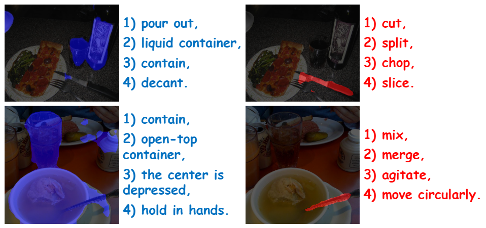
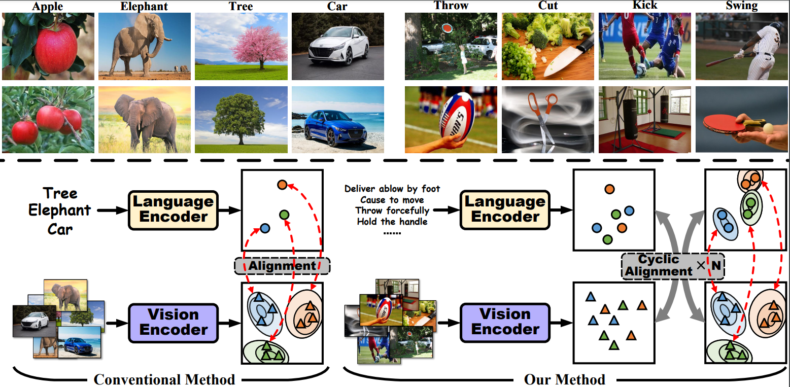
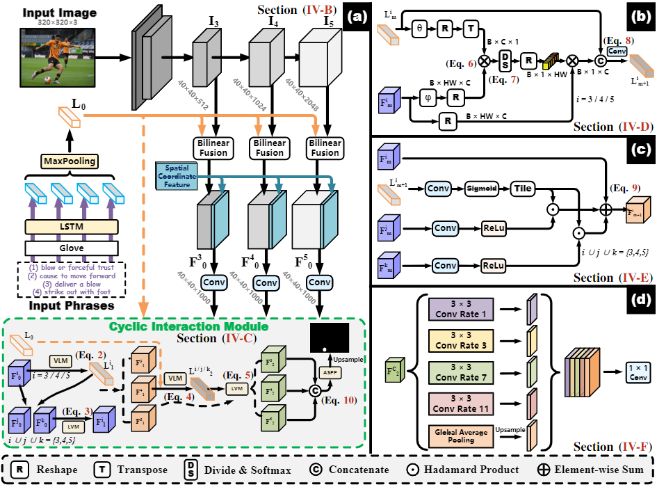
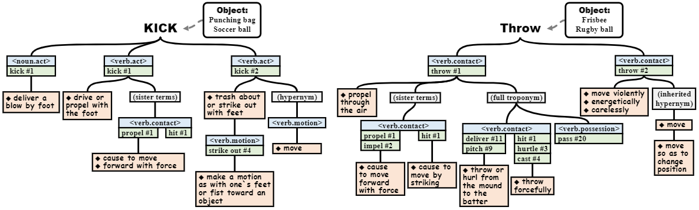
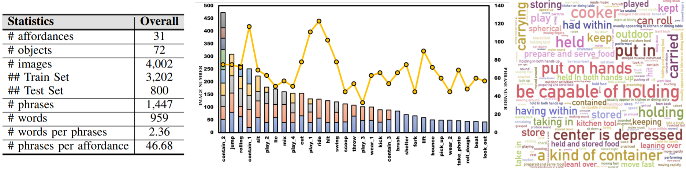
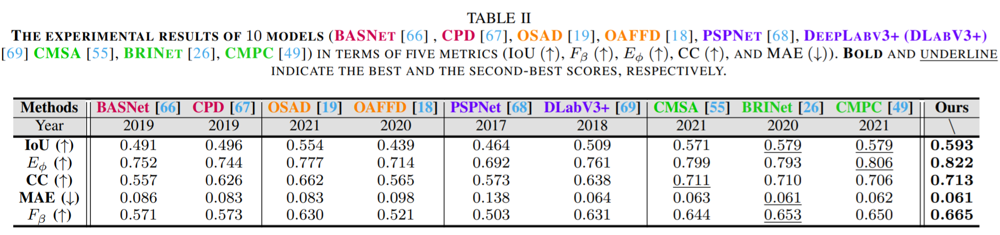
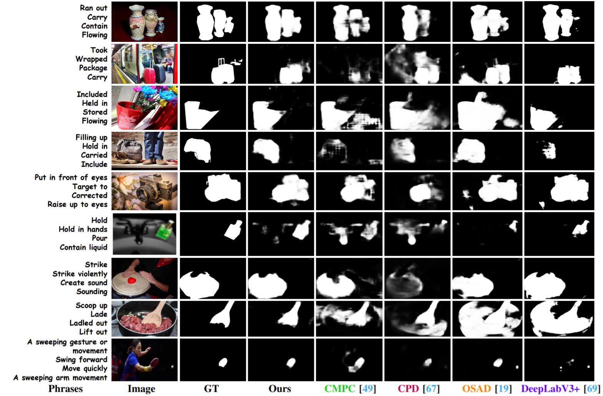
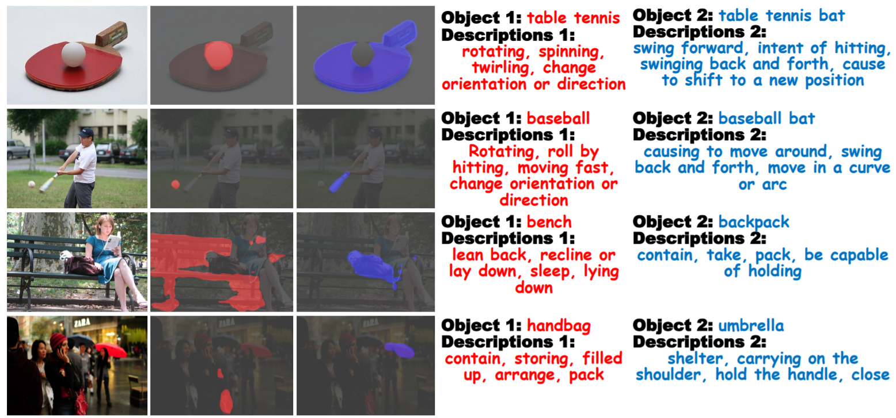
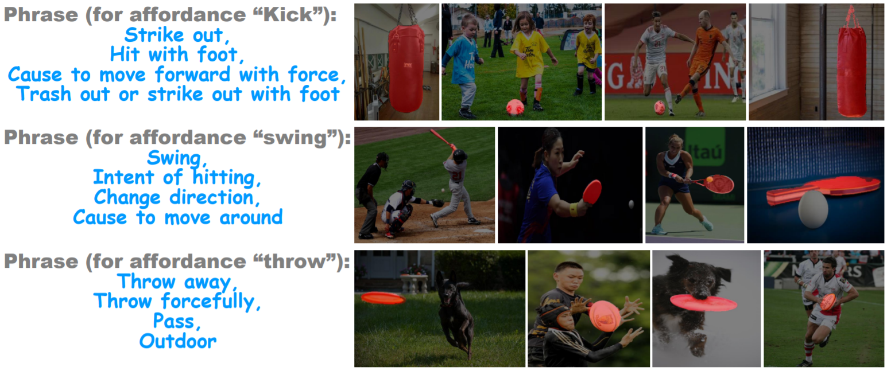

# Phrase-Based Affordance Detection via Cyclic Bilateral Interaction

TensorFlow implementation of ''Phrase-Based Affordance Detection via Cyclic Bilateral Interaction''. 

## 📋 Table of content
 1. [📎 Paper Link](#1)
 2. [💡 Abstract](#2)
 3. [✨ Motivation](#3)
 4. [📖 Method](#4)
 5. [📂 Dataset](#5)
 6. [📃 Requirements](#6)
 7. [✏️ Usage](#7)
 8. [📊 Experimental Results](#8)
 9. [✉️ Statement](#9)
 10. [🔍 Citation](#10)

## 📎 Paper Link <a name="1"></a> 
> Phrase-Based Affordance Detection via Cyclic Bilateral Interaction ([link](https://arxiv.org/pdf/xxxx.xxxxx.pdf))
* Authors: Liangsheng Lu*, Wei Zhai*, Hongchen Luo, Yang Cao
* Institution: University of Science and Technology of China (USTC)

## 💡 Abstract <a name="2"></a> 
Affordance detection, a task to perceive objects with potential action possibilities in images. Since affordance is closely related to the environment and the operator, it is difficult to generalize well by only constructing mapping relations from object representations to affordance labels. Previous works mainly focus on mining human-object cues from images and videos to accommodate affordance properties which changes dynamically. In this paper, from a language perspective, we explore the ability of robots to perceive affordance in multimodal scenarios with multiple information inputs. We first consider the challenging phrase-based affordance detection, i.e. input a set of phrases describing affordance and an image, the objects which can afford the affordance are expected to be segmented. To this end, we propose a cyclic bilateral consistency enhancement network (CBCE-Net) to align language and vision features step by step. Specifically, in CBCE-Net, we design Vision guided Language Module (VLM) and Language guided Vision Module (LVM) to update features using information from the other modality and a cyclic interaction module (CIM) to facilitate the interaction in a cyclic manner. Our model can effectively tackle the problem of large visual variations of objects with the same language descriptions caused by multiplicity property of affordance. Besides, we use short phrases to annotate affordance categories based on existing PAD dataset to get a new PAD-Language dataset. Considering nine typical methods in four relevant fields as comparison, extensive experiments indicate that our model outperform other methods in terms of both objective evaluation metrics and visual quality, which could be a strong baseline in this task.

<p align="center">
     <br />
    <em> 
    </em>
</p>

**Illustration of perceiving affordance.** Given a set of phrases that describes the affordance, the corresponding objects could be detected. In the first row, the phrases in blue and red indicate affordance “contain” and “cut”, then the corresponding objects “beer bottle” and “knife” with these affordances are segmented in blue and red, respectively. In the second row, the phrases in blue and red indicate affordances “contain” and “scoop”, and the objects “cup”, “bowl” and “spoon” are highlighted in blue and red, respectively.

## ✨ Motivation <a name="3"></a> 

<p align="center">
     <br />
    <em> 
    </em>
</p>

**Task difference and method difference between affordance related vision-language task and traditional ones.** (a) shows the problems caused by the multiplicity property of affordance. In traditional V-L tasks, the appearances of objects with same language descriptions are generally similar while the differences is significant in affordance related V-L task. For pictures on the left, objects referred by the same entity phrases are similar in color, shape and texture, nevertheless the opposite is true for images on the right. In (b), we compare our method with conventional methods. In conventional method, vision features are close enough in distance in feature space which leads to easier alignment. However, for affordance related V-L task, vision and language features are cluttered in feature space. We design a cyclic and bilateral mechanism to cope with this problems with enhancing iter-modal semantic consistency step by step. (See Section IV for details.)


## 📖 Method <a name="4"></a> 

<p align="center">
     <br />
    <em> 
    </em>
</p>

**The architecture of our proposed CBCE-Net.** CBCE-Net first uses DeepLab Resnet101 [62] and LSTM [58] to extract multi-level visual and linguistic features, respectively. Subsequently, combining spatial coordinate, multi-level multi-modal features are generated through bilinear fusion operations (see Section IV-B for details). Afterwards, fused features are fed into CIM module to enhance the semantic consistency in a cyclic and bilateral manner (See Section IV-C for details). In CIM module, we design a VLM module (see Section IV-D) and a LVM module (see Section IV-E) to update visual and linguistic features bilaterally with the guidance of each other. VLM is showed in part (b) in the top right corner and LVM is illustrated in part (c). Note that in LVM, the original feature is showed at the top left corner which denoted as Fim and the updated feature is at the output denoting as Fim+1. At last, a ASPP module (shown in part (d)) receives the final concatenated fused features and generate predicted masks (see Section IV-F).

## 📂 Dataset <a name="5"></a> 

<p align="center">
     <br />
    <em> 
    </em>
</p>

**Examples of utilizing WordNet to explore potential actions which can be performed on specific objects.** WordNet groups words together based on specific senses. The interlinks between words in WordNet could be visually organized in the form of tree diagram. Verbs in WordNet are classified into 9 major categories while nouns in 25 categories. As for the word “Kick” in WordNet, there are 6 distinct senses when it is treated as a noun and 8 different senses when it is a verb. In the tree diagram, “hnoun.acti kick #1” indicates that the first sense of noun “kick” belongs to “act” category. This semantic sense is glossed to “deliver a blow by foot” which could be an annotation phrase to affordance “kick”. After filtering out irrelevant words semantic domains to affordance such as hverb.emotioni, hverb.competitioni, etc. we find that hverb.acti, hverb.motioni, hverb.contacti and hnoun.acti are the most associated ones. Besides, we utilize the linguistic concepts in WordNet to explore richer expressions. In the tree diagram, “hypernym” denotes more abstract and generic words, (e.g. “move” is the hypernym of “kick”), the expression “sister terms” is used to represent a pair of synsets (sets of cognitive synonyms) which share a hypernym and “troponym” indicates a “manner” relation between two verbs. With the leverage of these semantic relations, nodes in the tree diagrams could be employed as affordance annotations.


<p align="center">
     <br />
    <em> 
    </em>
</p>

**Statistics of PAD-L.** Table on the left shows the statistics of all data. The middle chart illustrates the image number and phrase number according to affordance categories. The bars represent image numbers with every part in the bar indicating image number of every object category and the line chart shows phrase numbers. The cloud of phrases on the right has the font sizes proportional to square-root of frequencies in proposed PAD-L.

### Download Datasets 

* PAD Dataset can be available from [ [Google Drive](https://drive.google.com/file/d/1uKpyIv6rq_R8G2M2ALj6zRe0otkFthPN/view?usp=sharing) | [Baidu Pan](https://pan.baidu.com/s/11lEf4Y05jES2ntb4aS8QaQ) (z40m) ]. The paper of PAD can be obtained from this link ([PAD Paper](https://arxiv.org/abs/2106.14747)) and its project is in [github.com/lhc1224/OSAD_Net](https://github.com/lhc1224/OSAD_Net).

* PAD-L Dataset can be available from [[ Google Drive](https://drive.google.com/drive/folders/16wor2E1MotxeYkSdUC8wTBFMbYM0w1Q9?usp=sharing) | [Baidu Pan](https://pan.baidu.com/s/19ltCRoPuzBLvlhQ4M8PqOA) (qfwj) ].

## 📃 Requirements <a name="6"></a> 
  - python 3
  - tensorflow 
  - opencv 

## ✏️ Usage <a name="7"></a> 

Code will be released.

## 📊 Experimental Results <a name="8"></a> 


<p align="center">
     <br />
    <em> 
    </em>
</p>

<p align="center">
     <br />
    <em> 
    </em>
</p>

<p align="center">
     <br />
    <em> 
    </em>
</p>

<p align="center">
     <br />
    <em> 
    </em>
</p>

## ✉️ Statement <a name="9"></a> 
This project is for research purpose only, please contact us for the licence of commercial use. For any other questions please contact [lulsheng@mail.ustc.edu.cn](lulsheng@mail.ustc.edu.cn) or [wzhai056@mail.ustc.edu.cn](wzhai056@mail.ustc.edu.cn).


## 🔍 Citation <a name="10"></a> 

```
@inproceedings{Lu2022Phrase,
  title={Phrase-Based Affordance Detection via Cyclic Bilateral Interaction},
  author={Liangsheng Lu and Wei Zhai and Hongchen Luo and Yang Cao},
  year={2022}
}
```

